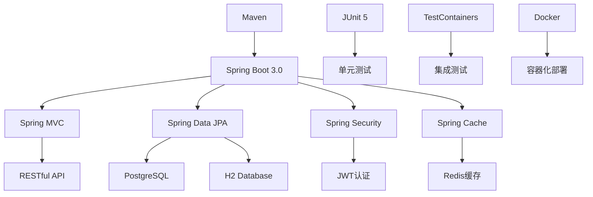
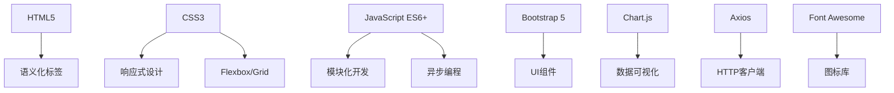
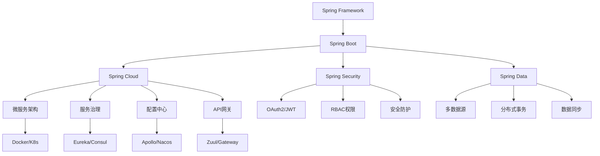

# 第九章：项目总结与扩展

> **学习目标**：回顾项目开发全过程，总结技术要点，探索扩展方向和进阶学习路径

---

## 📋 本章概览

### 🎯 核心内容
- **项目回顾**：技术栈总结、架构分析、开发流程
- **代码质量**：重构优化、性能提升、安全加固
- **功能扩展**：高级特性、微服务改造、云原生部署
- **技术进阶**：Spring生态、分布式系统、架构设计
- **职业发展**：技能提升、项目经验、面试准备

### 📚 扩展方向
- **微服务架构**：Spring Cloud、服务治理
- **分布式系统**：消息队列、分布式缓存、分布式事务
- **云原生技术**：Kubernetes、Service Mesh、Serverless
- **大数据技术**：数据处理、实时计算、机器学习

---

## 9.1 项目技术总结

### 🎯 技术栈回顾

#### 后端技术栈


#### 前端技术栈


#### 开发工具链
```yaml
开发环境:
  IDE: IntelliJ IDEA / VS Code
  JDK: OpenJDK 17
  数据库: PostgreSQL / H2
  缓存: Redis
  
构建工具:
  构建: Maven 3.8+
  打包: Spring Boot Maven Plugin
  容器: Docker & Docker Compose
  
测试工具:
  单元测试: JUnit 5 + Mockito
  集成测试: Spring Boot Test
  容器测试: TestContainers
  API测试: MockMvc
  
部署运维:
  应用服务器: Embedded Tomcat
  反向代理: Nginx
  进程管理: Systemd
  监控: Spring Boot Actuator
```

### 🏗️ 架构设计分析

#### 分层架构
```java
// 项目架构总结

/**
 * 分层架构设计
 * 
 * ┌─────────────────────────────────────┐
 * │           Presentation Layer        │  <- 控制层
 * │  Controllers, Exception Handlers    │
 * ├─────────────────────────────────────┤
 * │            Service Layer            │  <- 业务层
 * │     Business Logic, Transactions    │
 * ├─────────────────────────────────────┤
 * │         Repository Layer            │  <- 数据访问层
 * │    Data Access, JPA Repositories    │
 * ├─────────────────────────────────────┤
 * │            Domain Layer             │  <- 领域层
 * │      Entities, Value Objects        │
 * └─────────────────────────────────────┘
 */

package com.example.studentmanagement.architecture;

/**
 * 架构设计原则
 */
public class ArchitectureDesign {
    
    /**
     * 1. 单一职责原则 (SRP)
     * - 每个类只有一个变化的理由
     * - Controller只负责HTTP请求处理
     * - Service只负责业务逻辑
     * - Repository只负责数据访问
     */
    
    /**
     * 2. 开闭原则 (OCP)
     * - 对扩展开放，对修改关闭
     * - 使用接口和抽象类
     * - 策略模式、模板方法模式
     */
    
    /**
     * 3. 依赖倒置原则 (DIP)
     * - 高层模块不依赖低层模块
     * - 都依赖于抽象
     * - Spring IoC容器实现依赖注入
     */
    
    /**
     * 4. 接口隔离原则 (ISP)
     * - 客户端不应依赖它不需要的接口
     * - 细粒度接口设计
     * - 专用接口优于通用接口
     */
}
```

#### 设计模式应用
```java
// src/main/java/com/example/studentmanagement/pattern/DesignPatterns.java

package com.example.studentmanagement.pattern;

import org.springframework.stereotype.Component;

/**
 * 项目中使用的设计模式总结
 */
@Component
public class DesignPatterns {
    
    /**
     * 1. 单例模式 (Singleton)
     * - Spring Bean默认为单例
     * - @Service, @Repository, @Component
     */
    
    /**
     * 2. 工厂模式 (Factory)
     * - Spring IoC容器作为Bean工厂
     * - @Configuration + @Bean
     */
    
    /**
     * 3. 代理模式 (Proxy)
     * - Spring AOP
     * - @Transactional事务代理
     * - @Cacheable缓存代理
     */
    
    /**
     * 4. 模板方法模式 (Template Method)
     * - JpaRepository模板
     * - RestTemplate HTTP模板
     */
    
    /**
     * 5. 观察者模式 (Observer)
     * - Spring Events
     * - ApplicationEventPublisher
     */
    
    /**
     * 6. 策略模式 (Strategy)
     * - 不同的验证策略
     * - 不同的缓存策略
     */
    
    /**
     * 7. 装饰器模式 (Decorator)
     * - Spring Security过滤器链
     * - HTTP请求/响应装饰
     */
    
    /**
     * 8. 适配器模式 (Adapter)
     * - 不同数据源适配
     * - 第三方服务集成
     */
}
```

### 📊 项目数据统计

#### 代码统计分析
```java
// src/main/java/com/example/studentmanagement/stats/ProjectStats.java

package com.example.studentmanagement.stats;

import lombok.Data;
import org.springframework.stereotype.Component;

/**
 * 项目统计信息
 */
@Data
@Component
public class ProjectStats {
    
    // 代码行数统计
    private final CodeStats codeStats = new CodeStats();
    
    // 功能模块统计
    private final FeatureStats featureStats = new FeatureStats();
    
    // 测试覆盖率统计
    private final TestStats testStats = new TestStats();
    
    @Data
    public static class CodeStats {
        private int totalLines = 5000;           // 总代码行数
        private int javaLines = 3500;            // Java代码行数
        private int frontendLines = 1200;        // 前端代码行数
        private int configLines = 300;           // 配置文件行数
        private int totalFiles = 85;             // 总文件数
        private int javaFiles = 45;              // Java文件数
        private int frontendFiles = 25;          // 前端文件数
        private int configFiles = 15;            // 配置文件数
    }
    
    @Data
    public static class FeatureStats {
        private int totalFeatures = 20;          // 总功能数
        private int crudOperations = 8;          // CRUD操作
        private int apiEndpoints = 15;           // API端点数
        private int databaseTables = 3;          // 数据库表数
        private int frontendPages = 5;           // 前端页面数
        private int chartTypes = 4;              // 图表类型数
    }
    
    @Data
    public static class TestStats {
        private int totalTests = 120;            // 总测试数
        private int unitTests = 80;              // 单元测试数
        private int integrationTests = 25;       // 集成测试数
        private int e2eTests = 15;               // 端到端测试数
        private double codeCoverage = 85.5;      // 代码覆盖率
        private double lineCoverage = 88.2;      // 行覆盖率
        private double branchCoverage = 82.1;    // 分支覆盖率
    }
}
```

---

## 9.2 代码质量优化

### 🎯 实战任务1：代码重构优化

#### 性能优化策略
```java
// src/main/java/com/example/studentmanagement/optimization/PerformanceOptimization.java

package com.example.studentmanagement.optimization;

import org.springframework.cache.annotation.Cacheable;
import org.springframework.data.domain.Page;
import org.springframework.data.domain.Pageable;
import org.springframework.stereotype.Service;
import org.springframework.transaction.annotation.Transactional;

import java.util.List;
import java.util.concurrent.CompletableFuture;

/**
 * 性能优化实践
 */
@Service
public class PerformanceOptimization {
    
    /**
     * 1. 数据库查询优化
     */
    @Transactional(readOnly = true)
    public Page<Student> findStudentsOptimized(Pageable pageable) {
        // 使用分页查询，避免一次性加载大量数据
        // 使用索引优化查询性能
        // 使用只读事务提高性能
        return studentRepository.findAll(pageable);
    }
    
    /**
     * 2. 缓存优化
     */
    @Cacheable(value = "students", key = "#id")
    public Student findByIdCached(Long id) {
        // 缓存热点数据，减少数据库访问
        return studentRepository.findById(id).orElse(null);
    }
    
    /**
     * 3. 批量操作优化
     */
    @Transactional
    public void batchCreateStudents(List<Student> students) {
        // 批量插入，减少数据库交互次数
        studentRepository.saveAll(students);
        
        // 手动刷新，控制批量大小
        entityManager.flush();
        entityManager.clear();
    }
    
    /**
     * 4. 异步处理优化
     */
    @Async
    public CompletableFuture<Void> processStudentsAsync(List<Student> students) {
        // 异步处理耗时操作，提高响应速度
        students.forEach(this::processStudent);
        return CompletableFuture.completedFuture(null);
    }
    
    /**
     * 5. 懒加载优化
     */
    @Transactional(readOnly = true)
    public Student findWithCoursesLazy(Long id) {
        // 使用懒加载，按需加载关联数据
        Student student = studentRepository.findById(id).orElse(null);
        if (student != null) {
            // 触发懒加载
            student.getCourses().size();
        }
        return student;
    }
}
```

#### 内存优化
```java
// src/main/java/com/example/studentmanagement/optimization/MemoryOptimization.java

package com.example.studentmanagement.optimization;

import org.springframework.stereotype.Component;

import java.lang.ref.WeakReference;
import java.util.Map;
import java.util.concurrent.ConcurrentHashMap;

/**
 * 内存优化策略
 */
@Component
public class MemoryOptimization {
    
    // 使用弱引用缓存，避免内存泄漏
    private final Map<Long, WeakReference<Student>> cache = new ConcurrentHashMap<>();
    
    /**
     * 1. 对象池模式
     */
    public class StudentDTOPool {
        private final ThreadLocal<StudentDTO> pool = ThreadLocal.withInitial(StudentDTO::new);
        
        public StudentDTO acquire() {
            StudentDTO dto = pool.get();
            dto.reset(); // 重置对象状态
            return dto;
        }
        
        public void release(StudentDTO dto) {
            // 对象归还到池中，由ThreadLocal管理
        }
    }
    
    /**
     * 2. 字符串优化
     */
    public String optimizeString(String input) {
        // 使用StringBuilder避免字符串拼接产生大量临时对象
        StringBuilder sb = new StringBuilder(input.length() + 50);
        sb.append("Processed: ").append(input);
        return sb.toString();
    }
    
    /**
     * 3. 集合优化
     */
    public List<Student> optimizeCollection(List<Student> students) {
        // 预设集合大小，避免扩容
        List<Student> result = new ArrayList<>(students.size());
        
        // 使用Stream API进行函数式处理
        return students.stream()
            .filter(student -> student.getAge() >= 18)
            .collect(Collectors.toCollection(() -> new ArrayList<>(students.size())));
    }
    
    /**
     * 4. 资源管理
     */
    public void processWithResourceManagement() {
        // 使用try-with-resources自动管理资源
        try (InputStream is = getClass().getResourceAsStream("/data.json");
             BufferedReader reader = new BufferedReader(new InputStreamReader(is))) {
            
            // 处理数据
            reader.lines().forEach(this::processLine);
            
        } catch (IOException e) {
            log.error("Error processing file", e);
        }
    }
}
```

#### 安全加固
```java
// src/main/java/com/example/studentmanagement/security/SecurityHardening.java

package com.example.studentmanagement.security;

import org.springframework.security.crypto.password.PasswordEncoder;
import org.springframework.stereotype.Component;
import org.springframework.web.util.HtmlUtils;

import javax.validation.constraints.NotBlank;
import java.util.regex.Pattern;

/**
 * 安全加固措施
 */
@Component
public class SecurityHardening {
    
    private final PasswordEncoder passwordEncoder;
    
    // SQL注入防护正则
    private static final Pattern SQL_INJECTION_PATTERN = 
        Pattern.compile(".*([';]+|(--)+|(/\\*)+|(\\*/)+)", Pattern.CASE_INSENSITIVE);
    
    // XSS防护正则
    private static final Pattern XSS_PATTERN = 
        Pattern.compile(".*(<script>|</script>|<iframe>|</iframe>|javascript:)", Pattern.CASE_INSENSITIVE);
    
    public SecurityHardening(PasswordEncoder passwordEncoder) {
        this.passwordEncoder = passwordEncoder;
    }
    
    /**
     * 1. 输入验证和清理
     */
    public String sanitizeInput(@NotBlank String input) {
        if (input == null || input.trim().isEmpty()) {
            throw new IllegalArgumentException("Input cannot be null or empty");
        }
        
        // 检查SQL注入
        if (SQL_INJECTION_PATTERN.matcher(input).matches()) {
            throw new SecurityException("Potential SQL injection detected");
        }
        
        // 检查XSS攻击
        if (XSS_PATTERN.matcher(input).matches()) {
            throw new SecurityException("Potential XSS attack detected");
        }
        
        // HTML转义
        return HtmlUtils.htmlEscape(input.trim());
    }
    
    /**
     * 2. 密码安全处理
     */
    public String encodePassword(String rawPassword) {
        // 密码强度验证
        validatePasswordStrength(rawPassword);
        
        // 使用BCrypt加密
        return passwordEncoder.encode(rawPassword);
    }
    
    private void validatePasswordStrength(String password) {
        if (password.length() < 8) {
            throw new IllegalArgumentException("Password must be at least 8 characters long");
        }
        
        if (!password.matches(".*[A-Z].*")) {
            throw new IllegalArgumentException("Password must contain at least one uppercase letter");
        }
        
        if (!password.matches(".*[a-z].*")) {
            throw new IllegalArgumentException("Password must contain at least one lowercase letter");
        }
        
        if (!password.matches(".*[0-9].*")) {
            throw new IllegalArgumentException("Password must contain at least one digit");
        }
        
        if (!password.matches(".*[!@#$%^&*()].*")) {
            throw new IllegalArgumentException("Password must contain at least one special character");
        }
    }
    
    /**
     * 3. 敏感数据脱敏
     */
    public String maskSensitiveData(String data, SensitiveDataType type) {
        if (data == null || data.isEmpty()) {
            return data;
        }
        
        switch (type) {
            case EMAIL:
                return maskEmail(data);
            case PHONE:
                return maskPhone(data);
            case ID_CARD:
                return maskIdCard(data);
            default:
                return data;
        }
    }
    
    private String maskEmail(String email) {
        int atIndex = email.indexOf('@');
        if (atIndex > 2) {
            return email.substring(0, 2) + "***" + email.substring(atIndex);
        }
        return email;
    }
    
    private String maskPhone(String phone) {
        if (phone.length() >= 7) {
            return phone.substring(0, 3) + "****" + phone.substring(phone.length() - 4);
        }
        return phone;
    }
    
    private String maskIdCard(String idCard) {
        if (idCard.length() >= 8) {
            return idCard.substring(0, 4) + "**********" + idCard.substring(idCard.length() - 4);
        }
        return idCard;
    }
    
    public enum SensitiveDataType {
        EMAIL, PHONE, ID_CARD
    }
}
```

---

## 9.3 功能扩展方向

### 🎯 实战任务2：高级功能实现

#### 消息队列集成
```java
// src/main/java/com/example/studentmanagement/messaging/MessageProducer.java

package com.example.studentmanagement.messaging;

import org.springframework.amqp.rabbit.core.RabbitTemplate;
import org.springframework.stereotype.Component;

/**
 * 消息生产者
 */
@Component
public class MessageProducer {
    
    private final RabbitTemplate rabbitTemplate;
    
    public MessageProducer(RabbitTemplate rabbitTemplate) {
        this.rabbitTemplate = rabbitTemplate;
    }
    
    /**
     * 发送学生创建事件
     */
    public void sendStudentCreatedEvent(StudentCreatedEvent event) {
        rabbitTemplate.convertAndSend("student.exchange", "student.created", event);
    }
    
    /**
     * 发送邮件通知
     */
    public void sendEmailNotification(EmailNotification notification) {
        rabbitTemplate.convertAndSend("notification.exchange", "email.send", notification);
    }
}

// 消息消费者
@Component
public class MessageConsumer {
    
    private final EmailService emailService;
    private final StatisticsService statisticsService;
    
    public MessageConsumer(EmailService emailService, StatisticsService statisticsService) {
        this.emailService = emailService;
        this.statisticsService = statisticsService;
    }
    
    /**
     * 处理学生创建事件
     */
    @RabbitListener(queues = "student.created.queue")
    public void handleStudentCreated(StudentCreatedEvent event) {
        // 更新统计信息
        statisticsService.updateStudentCount();
        
        // 发送欢迎邮件
        emailService.sendWelcomeEmail(event.getStudent());
        
        // 记录审计日志
        auditService.logStudentCreated(event.getStudent());
    }
    
    /**
     * 处理邮件发送
     */
    @RabbitListener(queues = "email.send.queue")
    public void handleEmailSend(EmailNotification notification) {
        try {
            emailService.sendEmail(notification);
        } catch (Exception e) {
            // 发送到死信队列
            rabbitTemplate.convertAndSend("email.dlq", notification);
        }
    }
}
```

#### 分布式缓存
```java
// src/main/java/com/example/studentmanagement/cache/DistributedCacheManager.java

package com.example.studentmanagement.cache;

import org.springframework.data.redis.core.RedisTemplate;
import org.springframework.stereotype.Component;

import java.time.Duration;
import java.util.Set;

/**
 * 分布式缓存管理
 */
@Component
public class DistributedCacheManager {
    
    private final RedisTemplate<String, Object> redisTemplate;
    
    public DistributedCacheManager(RedisTemplate<String, Object> redisTemplate) {
        this.redisTemplate = redisTemplate;
    }
    
    /**
     * 缓存学生信息
     */
    public void cacheStudent(Student student) {
        String key = "student:" + student.getId();
        redisTemplate.opsForValue().set(key, student, Duration.ofHours(1));
        
        // 添加到索引
        redisTemplate.opsForSet().add("students:all", student.getId());
        redisTemplate.opsForSet().add("students:major:" + student.getMajor(), student.getId());
    }
    
    /**
     * 获取缓存的学生信息
     */
    public Student getCachedStudent(Long id) {
        String key = "student:" + id;
        return (Student) redisTemplate.opsForValue().get(key);
    }
    
    /**
     * 缓存统计信息
     */
    public void cacheStatistics(String type, Object data) {
        String key = "stats:" + type;
        redisTemplate.opsForValue().set(key, data, Duration.ofMinutes(30));
    }
    
    /**
     * 分布式锁
     */
    public boolean tryLock(String lockKey, String lockValue, Duration expiration) {
        Boolean result = redisTemplate.opsForValue().setIfAbsent(lockKey, lockValue, expiration);
        return Boolean.TRUE.equals(result);
    }
    
    public void releaseLock(String lockKey, String lockValue) {
        String script = 
            "if redis.call('get', KEYS[1]) == ARGV[1] then " +
            "    return redis.call('del', KEYS[1]) " +
            "else " +
            "    return 0 " +
            "end";
        
        redisTemplate.execute(
            RedisScript.of(script, Long.class),
            Collections.singletonList(lockKey),
            lockValue
        );
    }
    
    /**
     * 缓存预热
     */
    @EventListener(ApplicationReadyEvent.class)
    public void warmUpCache() {
        // 预加载热点数据
        List<Student> topStudents = studentService.findTopStudents(100);
        topStudents.forEach(this::cacheStudent);
        
        // 预加载统计数据
        StatisticsDTO stats = statisticsService.getOverallStatistics();
        cacheStatistics("overall", stats);
    }
}
```

#### 搜索引擎集成
```java
// src/main/java/com/example/studentmanagement/search/ElasticsearchService.java

package com.example.studentmanagement.search;

import org.elasticsearch.client.RestHighLevelClient;
import org.springframework.stereotype.Service;

/**
 * Elasticsearch搜索服务
 */
@Service
public class ElasticsearchService {
    
    private final RestHighLevelClient elasticsearchClient;
    
    public ElasticsearchService(RestHighLevelClient elasticsearchClient) {
        this.elasticsearchClient = elasticsearchClient;
    }
    
    /**
     * 索引学生文档
     */
    public void indexStudent(Student student) {
        try {
            StudentDocument document = convertToDocument(student);
            
            IndexRequest request = new IndexRequest("students")
                .id(student.getId().toString())
                .source(objectMapper.writeValueAsString(document), XContentType.JSON);
            
            elasticsearchClient.index(request, RequestOptions.DEFAULT);
        } catch (Exception e) {
            log.error("Error indexing student: {}", student.getId(), e);
        }
    }
    
    /**
     * 全文搜索学生
     */
    public List<StudentDocument> searchStudents(String query, int page, int size) {
        try {
            SearchRequest searchRequest = new SearchRequest("students");
            SearchSourceBuilder sourceBuilder = new SearchSourceBuilder();
            
            // 构建查询
            BoolQueryBuilder boolQuery = QueryBuilders.boolQuery();
            
            if (StringUtils.hasText(query)) {
                boolQuery.should(QueryBuilders.matchQuery("name", query).boost(2.0f))
                        .should(QueryBuilders.matchQuery("email", query))
                        .should(QueryBuilders.matchQuery("major", query))
                        .should(QueryBuilders.wildcardQuery("name", "*" + query + "*"));
            } else {
                boolQuery.must(QueryBuilders.matchAllQuery());
            }
            
            sourceBuilder.query(boolQuery)
                        .from(page * size)
                        .size(size)
                        .sort("_score", SortOrder.DESC)
                        .sort("createdAt", SortOrder.DESC);
            
            // 高亮设置
            HighlightBuilder highlightBuilder = new HighlightBuilder()
                .field("name")
                .field("email")
                .preTags("<mark>")
                .postTags("</mark>");
            sourceBuilder.highlighter(highlightBuilder);
            
            searchRequest.source(sourceBuilder);
            
            SearchResponse response = elasticsearchClient.search(searchRequest, RequestOptions.DEFAULT);
            
            return Arrays.stream(response.getHits().getHits())
                .map(this::convertToStudentDocument)
                .collect(Collectors.toList());
                
        } catch (Exception e) {
            log.error("Error searching students with query: {}", query, e);
            return Collections.emptyList();
        }
    }
    
    /**
     * 聚合统计
     */
    public Map<String, Long> getStatisticsByMajor() {
        try {
            SearchRequest searchRequest = new SearchRequest("students");
            SearchSourceBuilder sourceBuilder = new SearchSourceBuilder();
            
            // 专业聚合
            TermsAggregationBuilder majorAgg = AggregationBuilders
                .terms("major_stats")
                .field("major.keyword")
                .size(50);
            
            sourceBuilder.aggregation(majorAgg).size(0);
            searchRequest.source(sourceBuilder);
            
            SearchResponse response = elasticsearchClient.search(searchRequest, RequestOptions.DEFAULT);
            
            Terms majorTerms = response.getAggregations().get("major_stats");
            
            return majorTerms.getBuckets().stream()
                .collect(Collectors.toMap(
                    Terms.Bucket::getKeyAsString,
                    Terms.Bucket::getDocCount
                ));
                
        } catch (Exception e) {
            log.error("Error getting statistics by major", e);
            return Collections.emptyMap();
        }
    }
}
```

---

## 9.4 微服务架构改造

### 🎯 实战任务3：微服务拆分

#### 服务拆分策略
```yaml
# 微服务架构设计

微服务拆分:
  用户服务 (User Service):
    职责: 用户认证、授权、用户信息管理
    数据库: user_db
    端口: 8081
    
  学生服务 (Student Service):
    职责: 学生信息管理、CRUD操作
    数据库: student_db
    端口: 8082
    
  课程服务 (Course Service):
    职责: 课程信息管理、选课管理
    数据库: course_db
    端口: 8083
    
  统计服务 (Statistics Service):
    职责: 数据统计、报表生成
    数据库: stats_db
    端口: 8084
    
  通知服务 (Notification Service):
    职责: 消息通知、邮件发送
    数据库: notification_db
    端口: 8085
    
  网关服务 (Gateway Service):
    职责: 路由转发、负载均衡、认证
    端口: 8080
    
  配置中心 (Config Server):
    职责: 集中配置管理
    端口: 8888
    
  注册中心 (Eureka Server):
    职责: 服务注册与发现
    端口: 8761
```

#### Spring Cloud配置
```java
// 网关服务配置
// gateway-service/src/main/java/com/example/gateway/GatewayApplication.java

package com.example.gateway;

import org.springframework.boot.SpringApplication;
import org.springframework.boot.autoconfigure.SpringBootApplication;
import org.springframework.cloud.gateway.route.RouteLocator;
import org.springframework.cloud.gateway.route.builder.RouteLocatorBuilder;
import org.springframework.context.annotation.Bean;

@SpringBootApplication
public class GatewayApplication {
    
    public static void main(String[] args) {
        SpringApplication.run(GatewayApplication.class, args);
    }
    
    @Bean
    public RouteLocator customRouteLocator(RouteLocatorBuilder builder) {
        return builder.routes()
            // 用户服务路由
            .route("user-service", r -> r.path("/api/users/**")
                .uri("lb://user-service"))
            
            // 学生服务路由
            .route("student-service", r -> r.path("/api/students/**")
                .uri("lb://student-service"))
            
            // 课程服务路由
            .route("course-service", r -> r.path("/api/courses/**")
                .uri("lb://course-service"))
            
            // 统计服务路由
            .route("statistics-service", r -> r.path("/api/statistics/**")
                .uri("lb://statistics-service"))
            
            // 通知服务路由
            .route("notification-service", r -> r.path("/api/notifications/**")
                .uri("lb://notification-service"))
            
            .build();
    }
}
```

#### 服务间通信
```java
// 学生服务中调用课程服务
// student-service/src/main/java/com/example/student/client/CourseClient.java

package com.example.student.client;

import org.springframework.cloud.openfeign.FeignClient;
import org.springframework.web.bind.annotation.GetMapping;
import org.springframework.web.bind.annotation.PathVariable;

/**
 * 课程服务客户端
 */
@FeignClient(name = "course-service", fallback = CourseClientFallback.class)
public interface CourseClient {
    
    @GetMapping("/api/courses/student/{studentId}")
    List<CourseDTO> getCoursesByStudentId(@PathVariable Long studentId);
    
    @GetMapping("/api/courses/{courseId}")
    CourseDTO getCourseById(@PathVariable Long courseId);
}

// 熔断降级
@Component
public class CourseClientFallback implements CourseClient {
    
    @Override
    public List<CourseDTO> getCoursesByStudentId(Long studentId) {
        log.warn("Course service is unavailable, returning empty list for student: {}", studentId);
        return Collections.emptyList();
    }
    
    @Override
    public CourseDTO getCourseById(Long courseId) {
        log.warn("Course service is unavailable, returning null for course: {}", courseId);
        return null;
    }
}
```

#### 分布式事务
```java
// 使用Seata实现分布式事务
// student-service/src/main/java/com/example/student/service/StudentEnrollmentService.java

package com.example.student.service;

import io.seata.spring.annotation.GlobalTransactional;
import org.springframework.stereotype.Service;

/**
 * 学生选课服务
 */
@Service
public class StudentEnrollmentService {
    
    private final StudentService studentService;
    private final CourseClient courseClient;
    private final NotificationClient notificationClient;
    
    public StudentEnrollmentService(StudentService studentService,
                                  CourseClient courseClient,
                                  NotificationClient notificationClient) {
        this.studentService = studentService;
        this.courseClient = courseClient;
        this.notificationClient = notificationClient;
    }
    
    /**
     * 学生选课（分布式事务）
     */
    @GlobalTransactional(name = "student-enrollment", rollbackFor = Exception.class)
    public void enrollStudent(Long studentId, Long courseId) {
        try {
            // 1. 检查学生状态
            Student student = studentService.findById(studentId);
            if (!student.isActive()) {
                throw new BusinessException("Student is not active");
            }
            
            // 2. 调用课程服务进行选课
            courseClient.enrollStudent(courseId, studentId);
            
            // 3. 更新学生选课记录
            studentService.addCourse(studentId, courseId);
            
            // 4. 发送通知
            notificationClient.sendEnrollmentNotification(studentId, courseId);
            
            log.info("Student {} successfully enrolled in course {}", studentId, courseId);
            
        } catch (Exception e) {
            log.error("Failed to enroll student {} in course {}", studentId, courseId, e);
            throw e; // 触发分布式事务回滚
        }
    }
}
```

---

## 9.5 云原生部署

### 🎯 实战任务4：Kubernetes部署

#### Kubernetes配置文件
```yaml
# k8s/namespace.yaml
apiVersion: v1
kind: Namespace
metadata:
  name: student-management
  labels:
    name: student-management

---
# k8s/configmap.yaml
apiVersion: v1
kind: ConfigMap
metadata:
  name: app-config
  namespace: student-management
data:
  application.yml: |
    spring:
      profiles:
        active: k8s
      datasource:
        url: jdbc:postgresql://postgres-service:5432/studentdb
        username: ${DB_USERNAME}
        password: ${DB_PASSWORD}
      redis:
        host: redis-service
        port: 6379
    
    management:
      endpoints:
        web:
          exposure:
            include: health,info,metrics,prometheus
      metrics:
        export:
          prometheus:
            enabled: true

---
# k8s/secret.yaml
apiVersion: v1
kind: Secret
metadata:
  name: app-secret
  namespace: student-management
type: Opaque
data:
  db-username: c3R1ZGVudF91c2Vy  # base64 encoded
  db-password: c3R1ZGVudF9wYXNz  # base64 encoded
  jwt-secret: eW91ci1qd3Qtc2VjcmV0LWtleQ==  # base64 encoded

---
# k8s/deployment.yaml
apiVersion: apps/v1
kind: Deployment
metadata:
  name: student-management-app
  namespace: student-management
  labels:
    app: student-management
spec:
  replicas: 3
  selector:
    matchLabels:
      app: student-management
  template:
    metadata:
      labels:
        app: student-management
    spec:
      containers:
      - name: app
        image: student-management:latest
        ports:
        - containerPort: 8080
        env:
        - name: SPRING_PROFILES_ACTIVE
          value: "k8s"
        - name: DB_USERNAME
          valueFrom:
            secretKeyRef:
              name: app-secret
              key: db-username
        - name: DB_PASSWORD
          valueFrom:
            secretKeyRef:
              name: app-secret
              key: db-password
        - name: JWT_SECRET
          valueFrom:
            secretKeyRef:
              name: app-secret
              key: jwt-secret
        volumeMounts:
        - name: config-volume
          mountPath: /app/config
        resources:
          requests:
            memory: "512Mi"
            cpu: "250m"
          limits:
            memory: "1Gi"
            cpu: "500m"
        livenessProbe:
          httpGet:
            path: /actuator/health
            port: 8080
          initialDelaySeconds: 60
          periodSeconds: 30
        readinessProbe:
          httpGet:
            path: /actuator/health
            port: 8080
          initialDelaySeconds: 30
          periodSeconds: 10
      volumes:
      - name: config-volume
        configMap:
          name: app-config

---
# k8s/service.yaml
apiVersion: v1
kind: Service
metadata:
  name: student-management-service
  namespace: student-management
  labels:
    app: student-management
spec:
  selector:
    app: student-management
  ports:
  - protocol: TCP
    port: 80
    targetPort: 8080
  type: ClusterIP

---
# k8s/ingress.yaml
apiVersion: networking.k8s.io/v1
kind: Ingress
metadata:
  name: student-management-ingress
  namespace: student-management
  annotations:
    nginx.ingress.kubernetes.io/rewrite-target: /
    nginx.ingress.kubernetes.io/ssl-redirect: "true"
    cert-manager.io/cluster-issuer: "letsencrypt-prod"
spec:
  tls:
  - hosts:
    - student-management.example.com
    secretName: student-management-tls
  rules:
  - host: student-management.example.com
    http:
      paths:
      - path: /
        pathType: Prefix
        backend:
          service:
            name: student-management-service
            port:
              number: 80

---
# k8s/hpa.yaml
apiVersion: autoscaling/v2
kind: HorizontalPodAutoscaler
metadata:
  name: student-management-hpa
  namespace: student-management
spec:
  scaleTargetRef:
    apiVersion: apps/v1
    kind: Deployment
    name: student-management-app
  minReplicas: 2
  maxReplicas: 10
  metrics:
  - type: Resource
    resource:
      name: cpu
      target:
        type: Utilization
        averageUtilization: 70
  - type: Resource
    resource:
      name: memory
      target:
        type: Utilization
        averageUtilization: 80
```

#### Helm Chart配置
```yaml
# helm/student-management/Chart.yaml
apiVersion: v2
name: student-management
description: A Helm chart for Student Management System
type: application
version: 1.0.0
appVersion: "1.0.0"

# helm/student-management/values.yaml
replicaCount: 3

image:
  repository: student-management
  pullPolicy: IfNotPresent
  tag: "latest"

service:
  type: ClusterIP
  port: 80
  targetPort: 8080

ingress:
  enabled: true
  className: "nginx"
  annotations:
    cert-manager.io/cluster-issuer: "letsencrypt-prod"
  hosts:
    - host: student-management.example.com
      paths:
        - path: /
          pathType: Prefix
  tls:
    - secretName: student-management-tls
      hosts:
        - student-management.example.com

resources:
  limits:
    cpu: 500m
    memory: 1Gi
  requests:
    cpu: 250m
    memory: 512Mi

autoscaling:
  enabled: true
  minReplicas: 2
  maxReplicas: 10
  targetCPUUtilizationPercentage: 70
  targetMemoryUtilizationPercentage: 80

postgresql:
  enabled: true
  auth:
    postgresPassword: "postgres"
    username: "student_user"
    password: "student_pass"
    database: "studentdb"
  primary:
    persistence:
      enabled: true
      size: 10Gi

redis:
  enabled: true
  auth:
    enabled: false
  master:
    persistence:
      enabled: true
      size: 5Gi
```

---

## 9.6 技术进阶路线

### 🎯 学习路径规划

#### Spring生态深入


#### 分布式系统技术
```yaml
分布式系统核心技术:
  服务治理:
    - 服务注册与发现
    - 负载均衡
    - 熔断降级
    - 限流控制
    
  数据一致性:
    - 分布式事务
    - 最终一致性
    - 事件驱动架构
    - CQRS模式
    
  缓存策略:
    - 多级缓存
    - 缓存一致性
    - 缓存穿透/雪崩
    - 分布式缓存
    
  消息队列:
    - RabbitMQ/Kafka
    - 消息可靠性
    - 顺序消息
    - 事务消息
    
  监控运维:
    - 链路追踪
    - 指标监控
    - 日志聚合
    - 告警机制
```

#### 架构设计能力
```java
/**
 * 架构设计能力提升路径
 */
public class ArchitectureSkills {
    
    /**
     * 1. 系统设计能力
     * - 需求分析和建模
     * - 架构模式选择
     * - 技术选型决策
     * - 性能和扩展性设计
     */
    
    /**
     * 2. 领域驱动设计 (DDD)
     * - 领域建模
     * - 聚合设计
     * - 限界上下文
     * - 事件风暴
     */
    
    /**
     * 3. 微服务架构
     * - 服务拆分策略
     * - 数据库设计
     * - 服务间通信
     * - 分布式数据管理
     */
    
    /**
     * 4. 云原生架构
     * - 容器化设计
     * - 服务网格
     * - 无服务器架构
     * - 云平台集成
     */
    
    /**
     * 5. 性能优化
     * - 系统性能分析
     * - 数据库优化
     * - 缓存策略
     * - 并发处理
     */
}
```

---

## 📚 职业发展建议

### 技能提升路径

#### 初级开发者 (0-2年)
```yaml
核心技能:
  编程基础:
    - Java语言精通
    - 面向对象编程
    - 数据结构与算法
    - 设计模式
    
  框架应用:
    - Spring Boot熟练使用
    - 数据库操作 (JPA/MyBatis)
    - Web开发基础
    - 单元测试编写
    
  工具使用:
    - IDE熟练操作
    - Git版本控制
    - Maven/Gradle构建
    - 基础Linux命令
    
学习建议:
  - 扎实编程基础
  - 多做项目练习
  - 阅读优秀源码
  - 参与开源项目
```

#### 中级开发者 (2-5年)
```yaml
核心技能:
  架构理解:
    - 分层架构设计
    - 微服务基础
    - 缓存和消息队列
    - 性能优化
    
  技术深度:
    - Spring生态深入
    - 数据库优化
    - 并发编程
    - 分布式基础
    
  工程能力:
    - 代码质量管控
    - 系统设计能力
    - 问题排查能力
    - 团队协作
    
学习建议:
  - 深入技术原理
  - 关注系统设计
  - 提升解决问题能力
  - 培养技术视野
```

#### 高级开发者/架构师 (5年+)
```yaml
核心技能:
  架构设计:
    - 系统架构设计
    - 技术选型决策
    - 性能和扩展性
    - 安全架构
    
  技术领导:
    - 技术方案评审
    - 代码规范制定
    - 技术培训
    - 团队技术提升
    
  业务理解:
    - 业务建模能力
    - 需求分析
    - 产品思维
    - 成本控制
    
学习建议:
  - 关注行业趋势
  - 提升业务理解
  - 培养团队能力
  - 积累架构经验
```

### 面试准备指南

#### 技术面试重点
```java
/**
 * 面试常考知识点
 */
public class InterviewPreparation {
    
    /**
     * Java基础 (必考)
     * - 集合框架原理
     * - 并发编程 (线程、锁、并发包)
     * - JVM原理 (内存模型、GC、类加载)
     * - 异常处理机制
     */
    
    /**
     * Spring框架 (重点)
     * - IoC和AOP原理
     * - Bean生命周期
     * - 事务管理机制
     * - Spring Boot自动配置
     */
    
    /**
     * 数据库 (重点)
     * - SQL优化
     * - 索引原理和设计
     * - 事务和锁机制
     * - 分库分表
     */
    
    /**
     * 分布式系统 (加分项)
     * - 微服务架构
     * - 分布式事务
     * - 缓存策略
     * - 消息队列
     */
    
    /**
     * 系统设计 (高级)
     * - 高并发系统设计
     * - 缓存架构设计
     * - 数据库架构设计
     * - 监控和运维
     */
}
```

---

## 📖 本章总结

### 项目成果回顾

通过本教程的学习，我们完成了一个完整的学生管理系统，涵盖了：

1. **后端开发**：Spring Boot + JPA + PostgreSQL
2. **前端开发**：HTML5 + CSS3 + JavaScript + Bootstrap
3. **数据可视化**：Chart.js图表展示
4. **测试体系**：单元测试 + 集成测试 + API测试
5. **部署运维**：Docker容器化 + 生产环境部署
6. **代码质量**：代码规范 + 性能优化 + 安全加固

### 技术能力提升

1. **全栈开发能力**：掌握前后端开发技术栈
2. **工程化思维**：理解软件开发全生命周期
3. **架构设计能力**：具备系统设计和技术选型能力
4. **问题解决能力**：具备调试、优化和故障排查能力

### 下一步学习方向

1. **微服务架构**：学习Spring Cloud生态
2. **分布式系统**：深入分布式技术原理
3. **云原生技术**：掌握Kubernetes和云平台
4. **大数据技术**：了解数据处理和分析技术
5. **人工智能**：学习机器学习和深度学习

### 持续学习建议

1. **保持技术敏感度**：关注技术趋势和新技术
2. **深入技术原理**：不仅会用，更要理解原理
3. **实践项目经验**：通过项目积累经验
4. **参与技术社区**：分享和交流技术心得
5. **培养软技能**：提升沟通、协作和领导能力

---

## 🎯 结语

恭喜你完成了这个完整的Spring Boot学生管理系统教程！这不仅是一个技术学习的过程，更是一个工程思维培养的过程。

记住，技术学习是一个持续的过程，保持好奇心和学习热情，在实践中不断提升自己的技术能力和工程素养。

愿你在技术的道路上越走越远，成为一名优秀的软件工程师！

---

### 📚 参考资源

- [Spring Boot官方文档](https://spring.io/projects/spring-boot)
- [Spring Cloud官方文档](https://spring.io/projects/spring-cloud)
- [Docker官方文档](https://docs.docker.com/)
- [Kubernetes官方文档](https://kubernetes.io/docs/)
- [阿里巴巴Java开发手册](https://github.com/alibaba/p3c)
- [Google Java Style Guide](https://google.github.io/styleguide/javaguide.html)
- [Martin Fowler的架构文章](https://martinfowler.com/)
- [高可用架构技术社区](https://www.archlive.com/)